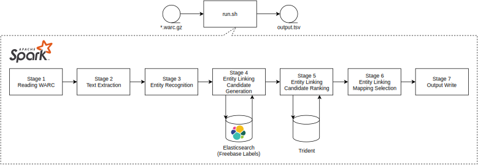
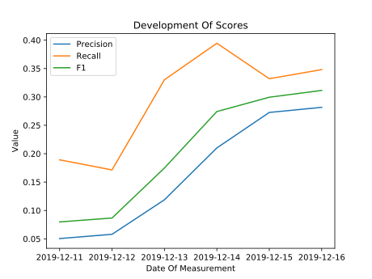

# Large Scale Entity Linking

> [Jump to Setup And Running (DAS4)](#3-das4-execution)

This repository showcases the Large Scale Entity Linking assignment from the Web Data Processing Course 2019 at VU Amsterdam. The solution presented here recognizes, extracts and links relevant entities from Web pages and links them to the Freebase Knowledge Base. All technologies and frameworks used, such as DragNet, LexVec, Trident and Spark, are freely available and should run (with minor changes) on any YARN-capable cluster. In the following sections we describe the motivation behind Entity Linking and how we solved the challenge of linking entities at large scale.

## Table Of Contents

[1. Motivation](#1-motivation)  
[2. Our Solution](#2-our-solution)  
[2.1. Architecture Overview](#21-architecture-overview)  
[2.2. WARC Reading](#22-warc-reading)  
[2.3. Text Extraction](#23-text-extraction)  
[2.4. Entity Recognition](#24-entity-recognition)    
[2.5. Entity Linking](#25-entity-linking)  
[2.5.1 Candidate Generation](#251-candidate-generation)  
[2.5.2 Candidate Ranking](#252-candidate-ranking)  
[2.5.3 Mapping Selection](#253-mapping-selection)  
[2.6. Output Write](#26-output-write)  
[3. DAS4 Execution](#3-das4-execution)  
[4. Discussion and Conclusion](#4-discussion-and-conclusion)  
[5. References](#5-references)  
[6. Appendix](#6-appendix)  

## 1. Motivation

Extracting knowledge from some corpus of data, be it audio, images, text or a similar medium, has been an important challenge in a lot of scenarios. May it be studying for an examniation, simply reading a book or computer-based knowledge acquisition from documents obtained from the Web. In this context Entity Linking is a common task, that can be used to acquire knowledge for the first time or aid other processing such as entity prediction.

However, do to the ever growing size of the Web scalable solutions are required. Therefore, we developed a scaleable Spark-based Entity Linking pipeline. This pipeline  uses Machine Learning to extract text from web documents, Neural Networks to identify relevant entity mentions in text, and the entities latent meaning to disambiguate between multiple canidates.

## 2. Our Solution

This section describes the architecture by introducing an overall overview and subsequent detailled description on each component.

### 2.1. Architecture Overview

Our Solution is built on the Big Data Framework Apache Spark [[1](#c1)] to allow scaling out with increasing document sizes and is divided into overall seven stages, as displayed in Figure [1](#img-architecture-overview). , which are described in more detail in the designated sections. The Entity Linking pipeline can be triggered by the [`run.sh`](./run.sh) bash script. The script reads the given input WARC file, copies it to HDFS (to allow Spark's worker nodes to access the file), and then submits the Python pipeline code ([`src/spark.py`](./src/spark.py)) to the YARN cluster. After job execution the output files are collected and copied to the local file system.
More information on how to run the pipeline can be found in Chapter [3. DAS4 Execution](#3-das4-execution).

<p align="center">
    
    <span style>Figure 1. Architecture Overview</span>
</p>

### 2.2. WARC Reading

The first stage (see [src/WARCSplitReader](src/WARCSplitReader.py)) is designated to read, parse, and preprocess the input file so that it can be further processed using the Spark's Resilient Distributed Dataset (RDD).

First, the entire file (which can contain multiple records) is reduced into chunks of lines by checking each line of the specific WARC line that indicates a new record (`WARC/1.0`).

These chunks are then parallelized by distributing them across the Spark Workers. Each Spark worker now parses the records into WARCRecord objects from the `warcio` library. Next, the content from each record that matches the `response` type from WARC's specification is fetched and added to the RDD. Finally, all records which could not be processed correctly (e.g., missing the record id) are being filtered out.

The advantage of this process is, that our pipeline should scale very well when the amount of documents in the WARC file is being increased. Using a single row for each document enables Spark to distribute the documents across the cluster, therefore it is argued that scalability is almost guaranteed. We could add workers until every worker is only responsible for a single document (most extreme case). However, we currently assume that ElasticSearch and Trident also scale well. While we are using Trident's Python bindings, we would need to run ElasticSearch in cluster mode. However, due to the scope of this assignment we did not test this.

### 2.3. Text Extraction

After the WARC Reading stage has converted the input into separate HTML documents, this stage is responsible for extracting the main text from each HTML document (see [src/TextExtraction](src/TextExtraction.py)).

During the development, we realized that the subsequent stages are heavily influenced by how well the main text of a document is extracted. During development we tried three mayor methods:

1. Remove HTML boilerplate code by regular expressions (see [commit 533a378](https://github.com/WDPS-Team/2019-WDPS/blob/5858544732ab08322e8081e36023227c89a06117/src/TextPreprocessor.py#L57-L97))
2. Only include content from `<p>` tags in combination with 1. (see [commit a99d49](https://github.com/WDPS-Team/2019-WDPS/blob/a99d49bdd04151150e6a397f23a537d906fdfea7/src/TextPreprocessor.py#L86-L90))
3. Use Machine Learning Model DragNet [[3](#c3)] (see [commit 93acb64](https://github.com/WDPS-Team/2019-WDPS/blob/93acb64c8e831a1c040bb8d82c3556041213308d/src/TextPreprocessor.py#L67-L99))

After serveral iterations, testing, and reading relevant resources (compare [[4](#c4), [5](#c5)]) we decided that DragNet would be the best choice. Mainly because fine tuning rules on some training data brings the risk of fitting the rules too strict and specific for the given data. We acknowledged the fact that our the pipeline should be as generalized as possible. In fact, during validating our assumptions DragNet seemed most of the time return more relevant text than our handwritten rules.

However, in situations where DragNet fails to obtain any text we still use BeautifulSoup and points 1. & 2. as a fallback.

### 2.4. Entity Recognition

Based on initial research on neuralnetwork-based Entity Recognition (NeuroNER), we decided to use the NLP-framework Spacy [[6](#c6)] to do entity recognition. We evaluated other NER frameworks, but found that Spacy already provides a sophistiacted NLP-Preprocessing (including Tokenization, Stemming etc.) and also provides good accuracy compared to StandfordNER and other Entity Recognition frameworks.

### 2.5. Entity Linking

This section is split into three subsections, as the Entity Linking task is also splitted into three stages. First, the Candidate Generation, then the Candidate Ranking and finally the Mapping Selection is being discussed.

#### 2.5.1 Candidate Generation

@Abi TODO > Add candidate generation

#### 2.5.2 Candidate Ranking

@Abi TODO > Add ranking, also indicate which ranking methods we tried :-) -> doc2vec
 -> Other?

#### 2.5.3 Mapping Selection

@Abi TODO > Add ranking

### 2.6. Output Write

The output writing stage (see [src/OutputWriter](src/OutputWriter.py)), being the last stage of the Spark program, converts the RDD into a valid tab-separated representation, which can be saved by Spark's File API.
Afterwards these files can be copied from HDFS, as it is done in the [run.sh](run.sh).

## 3. DAS4 Execution

### Prerequisistes

@Abi TODO > what modules do need to be loaded on das?

### DAS4 Setup

Run `sh setup.sh` to build virtual environment and download the dependencies.

@Abi TODO > is that still true? do we load all models, if so -> remove!

### Quickrun:

1. `. start_elasticsearch_server.sh` + `./run.sh` will run the latest started elastic search instance and the defaults set in run.sh

### Start Elastic Search Server

1. Run `sh start_elasticsearch_server.sh` to start the Elastic Search server and it will run for 15 minutes by default.
2. The address of the cluster node will be displayed and you can make sure it's running using `curl <ES_NODE>:9200`

### Run Spark Job

`sh run.sh`

By default, `data/sample.warc.gz` will be taken as input and output will be in `output.tsv`. Job submission can be customized using the options -f, -o and -es.
Eg: `sh run.sh -f input.warc.gz -o out.tsv -es node007:9200`

## 4. Discussion and Conclusion

Overall, we believe that our entity linking, given the current limitations that we only use context-independent ranking methods, scores very well. Over the last iterations we were able to improve, precision, recall and as a result the F1 score significantly, especially due to using the latent meaning and Wikipedia-based data in entity ranking and DragNet in text extraction. Furthermore, we believe that adding additional context-dependent features and coherence measurements to the pipeline would provide even better scores, but could not be implemented in such way that it would improve the scores due to the given time limit. 

<p align="center">
    
    <br/>
    <span style>Figure 2. Score Development</span>
</p>

Addtionally, we identified a few examples which are currently disambiguated even better than the provided gold standard. These are, for example:

- @Abi TODO
- 

To conclude, our Spark-based pipeline evidently scales well with the amount of documents being processed. Furthermore, we currently acheive good results for the F1 score on the given gold standard. We argue to a certain extent, that this gold standard does actually provide not the correct entity links, but we also acknowledge that our pipeline still requires some work to acheive results as good as the gold standard file.

## 5. References

<p id="c1">
[1] The Apache Software Foundation, n.d., Apache Spark™ - Unified Analytics Engine for Big Data, viewed 19 Dec 2019, <https://spark.apache.org/>
</p>


<p id="c2">
[2]  Salle, A. and Villavicencio, A., 2018. Incorporating subword information into matrix factorization word embeddings. arXiv preprint arXiv:1805.03710.
</p>

<p id="c3">
[3] n.a., n.d., dragnet-org/dragnet: Just the facts -- web page content extraction, viewed 19 Dec 2019, <https://github.com/dragnet-org/dragnet/>
</p>

<p id="c4">
[4] McDonnell, M., 2015, Benchmarking Python Content Extraction Algorithms: Dragnet, Readability, Goose, and Eatiht, viewed 19 Dec 2019, <https://moz.com/devblog/benchmarking-python-content-extraction-algorithms-dragnet-readability-goose-and-eatiht/>
</p>

<p id="c5">
[5] Batchkarov, M., 2017, A Benchmark Comparison Of Content Extraction From HTML Pages, viewed 19 Dec 2019, <https://medium.com/@mbatchkarov/a-benchmark-comparison-of-extraction-from-html-pages-98d7c1229f51/>
</p>

<p id="c6">
[6] n.a., n.d., spaCy · Industrial-strength Natural Language Processing in Python, viewed 19 Dec 2019, <https://spacy.io/>
</p>


## 6. Appendix

### Local Development

#### Prerequsites

Ideally you use Docker for local development (esp. on Windows), thus you need:
- Docker (for Windows/Mac)
- docker-compose

#### Setup Local Components:

##### Building Base Image:

1. Execute `docker-compose -f docker-compose.base.yml build` to build the Spark base images.
2. Execute `docker-compose build` to build the relevant images for running the local development.

##### Install Dependencies for Development:

1. `pip3 install elasticsearch==7.1.0` for loading data into Elasticsearch

##### Loading Data into Elastic Search

1. Start Elasticsearch with `docker-compose up es01`
2. Run the following commands (given Python used python3):
    - `python3 load_elasticsearch.py localhost 9200 ./data/sample-labels-cheat.txt`

**Testing Elasticsearch**
Test with `curl "http://localhost:9200/freebase/label/_search?q=obama"`. Expect a freebase id linking to Obama.

##### Load Data into Trident

**Option 1 - Index Data**
1. Download and place KB data (alternatively copy an existing already indexed KB, see option 2)
    - Go to `trident/data`
    - create dir if necessary: `yago2s_input`
    - download yago2s knowledge base [here](https://www.mpi-inf.mpg.de/departments/databases-and-information-systems/research/yago-naga/yago/archive/)
    - extract in `yago2s_input` folder
2. Index the knowledge base with trident
    - Run `docker-compose run trident ./trident load -i /data/kb/trident -f /data/kb/yago2s_input`
    - Notice: You might need to increase the memory size for the Docker VM (Windows + MacOs), was tested with 8192MB on Win10
**Option 2 - Use Already Indexed KB**
1. Copy indexed knowledge base to `trident/data` so that the Trident files are stored under `trident/data/trident`

**Testing the Trident Store**

```
python3 sparql.py localhost:9090 "SELECT DISTINCT ?class WHERE {?s a ?class .} LIMIT 25 OFFSET 0"

python3 sparql.py localhost:9090 "SELECT ?subject ?predicate ?object WHERE {?subject ?predicate ?object} LIMIT 100"
```

#### Setup & Handling Spark

##### Setup

- Run `docker-compose run spark-submit /setup.sh`

#### Run Spark Job

- Run `docker-compose run spark-submit /submit.sh`

#### Reset the Local Development Enviroment

- Run `docker-compose down`, then load data back into Elasticsearch and redo Spark Setup.

### Handy Notes:

- Recursive copy from DAS-4 to local storage:  
  `scp -rp -oProxyJump=PERSONALUSERID@ssh.data.vu.nl USERID@fs0.das4.cs.vu.nl:/filepath ./target/`

- Access DAS4 Cluster from home:   
   `ssh -L22022:fs0.das4.cs.vu.nl:22 -oProxyJump=<VUNET_ID>@ssh.data.vu.nl <GROUP_ID>@fs0.das4.cs.vu.nl`
   Use `ssh://<DAS4_ID>@localhost:22022/` to mount in your file system.

- Access Elastic Search from home:
    `ssh -L9200:<ES_NODE>:9200 -oProxyJump=<VUNET_ID>@ssh.data.vu.nl <DAS4_ID>@fs0.das4.cs.vu.nl`
    
- Access Spark UI from home:
    `ssh -L8080:fs0.das4.cs.vu.nl:8088 -oProxyJump=<VUNET_ID>@ssh.data.vu.nl <DAS4_ID>@fs0.das4.cs.vu.nl`
    Now Spark UI should be accessible via `localhost:8080`
- Query Trident on local:
    `python3 sparql.py 'localhost:9090' "select * where {<http://rdf.freebase.com/ns/m.0d0xs> ?p ?o} limit 1000"`

